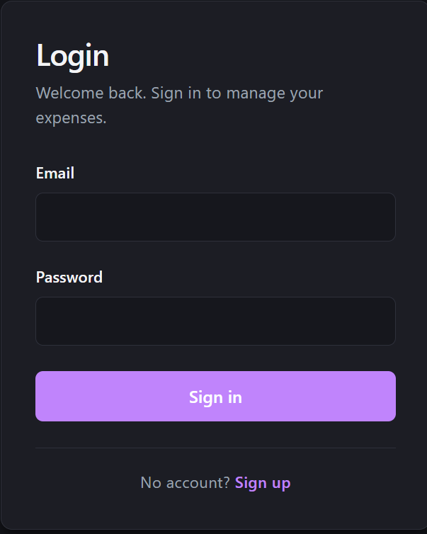
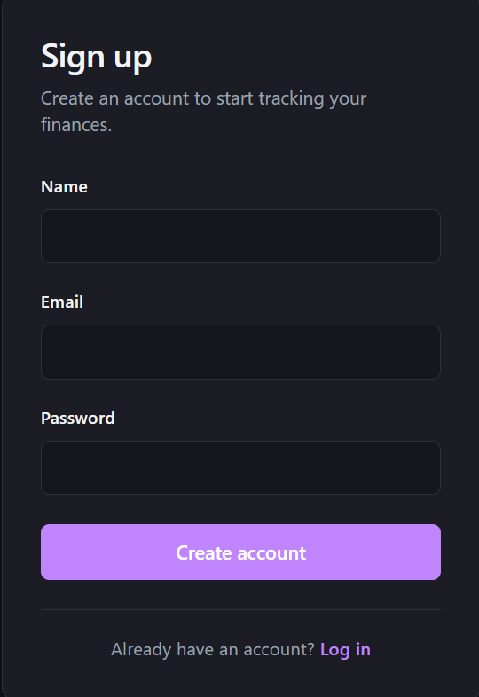
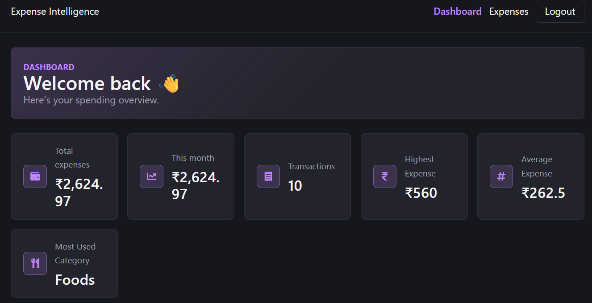
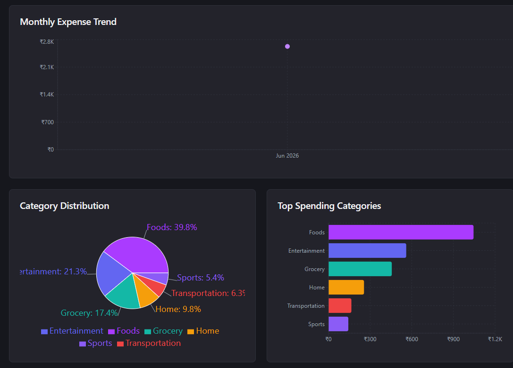
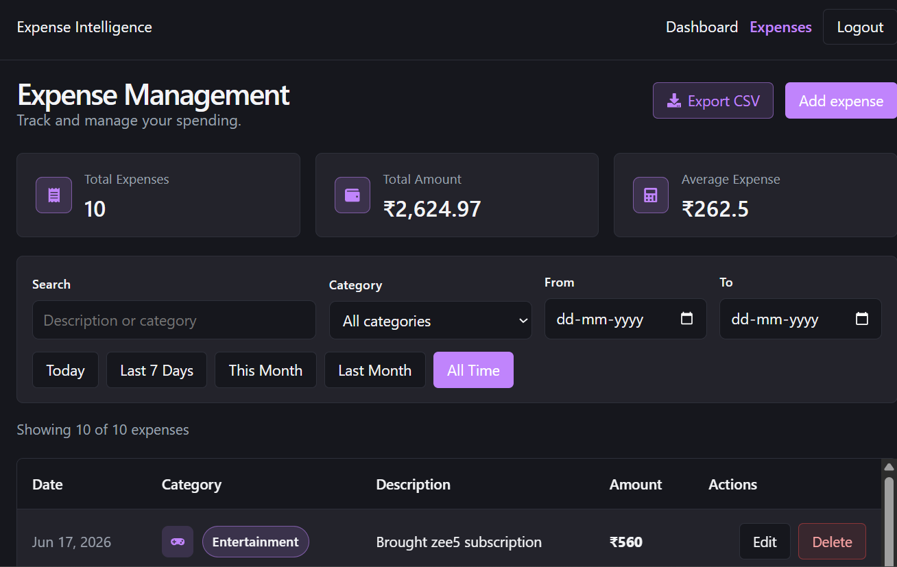
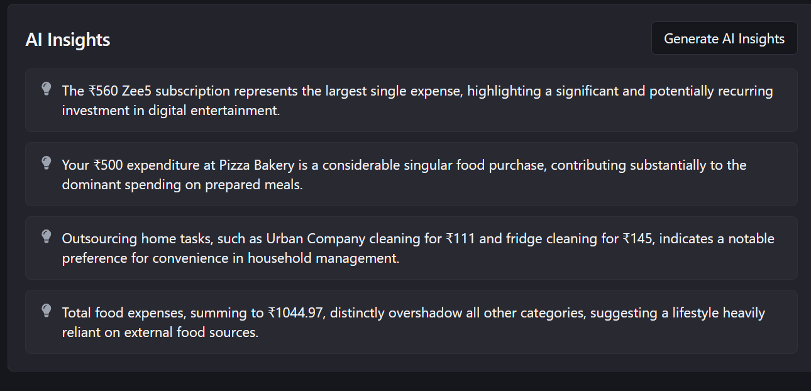
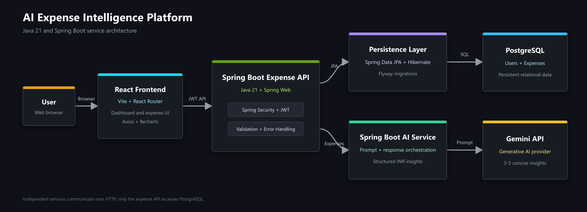
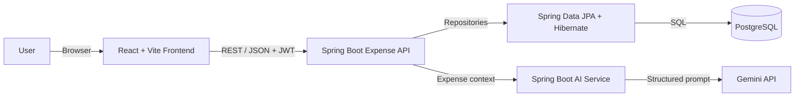

# AI Expense Intelligence Platform

[](https://github.com/Abhiii5540/ai-expense-intelligence-platform/actions/workflows/ci.yml)


An end-to-end, AI-powered personal finance platform built with React, Java, Spring Boot, and PostgreSQL. Users can securely manage expenses, explore interactive spending analytics, export filtered reports, and request concise INR-based financial insights generated with Gemini.

The project demonstrates service-oriented backend design, stateless JWT security, relational persistence, resilient external API integration, contract-preserving migration, automated testing, and containerized local development. The original Node.js and FastAPI services remain in the repository as a rollback reference while the Java services are adopted.

## Highlights

- Re-engineered the backend and AI integration as two independent Java 21 Spring Boot services.
- Preserved the existing React user experience, REST routes, response shapes, PostgreSQL tables, and JWT compatibility.
- Secured protected APIs with stateless Spring Security authentication and BCrypt password hashing.
- Built analytics for monthly trends, category distribution, top categories, and summary metrics.
- Integrated Gemini through a dedicated service with structured JSON output, INR safeguards, varied prompts, and transient retries.
- Added Flyway migrations, validation, centralized exception handling, tests, Dockerfiles, and Docker Compose.

## Architecture

```text
React + Vite Frontend
        |
        | REST / JSON + JWT
        v
Spring Boot Expense API ----> Spring Data JPA + Hibernate ----> PostgreSQL
        |
        | Expense context
        v
Spring Boot AI Service ------> Gemini API
```

## Project Metrics

- 3-tier application architecture
- 3 independently deployable application services
- 2 Spring Boot services
- Stateless JWT authentication
- AI-powered financial insights
- Interactive analytics dashboard
- CSV export and advanced client-side filtering
- Automated unit and PostgreSQL integration tests

## Features

- User signup, login, and authenticated profile retrieval
- Expense create, read, update, and delete workflows
- Dashboard totals, highest and average expense, and most-used category
- Monthly spending trend, category distribution, and top-category charts
- Gemini-generated financial insights expressed in Indian Rupees
- CSV export of currently filtered expenses
- Case-insensitive search, category filters, date ranges, and quick filters
- Loading skeletons, empty states, confirmation dialogs, and toast notifications
- Responsive dark theme with purple accents

## Screenshots

### Login



### Signup



### Dashboard



### Expense Analytics



### Expense Management



### AI Insights



### System Architecture



The editable architecture source is available at [`screenshots/architecture.svg`](screenshots/architecture.svg).

## System Architecture



Request flow:

1. The React frontend sends requests to the expense API through Axios.
2. Spring Security verifies the bearer token before protected controllers run.
3. Controllers delegate business operations to transactional services.
4. Spring Data JPA and Hibernate read and write the existing PostgreSQL tables.
5. For insights, the expense API sends normalized expense data to the AI service.
6. The AI service calls Gemini and returns exactly 3-5 concise INR insights.
7. The expense API forwards the unchanged insight response to the frontend.

## Tech Stack

| Layer | Technologies |
| --- | --- |
| Frontend | React, Vite, React Router, Axios, Recharts, React Icons, React Hot Toast |
| Expense API | Java 21, Spring Boot, Spring Web, Spring Security, Bean Validation |
| Persistence | Spring Data JPA, Hibernate, Flyway, PostgreSQL |
| AI Service | Java 21, Spring Boot, Spring `RestClient`, Gemini API |
| Testing | JUnit 5, Mockito, AssertJ, Testcontainers |
| Delivery | Maven, Docker, Docker Compose, Nginx |

## Repository Structure

```text
ai-expense-intelligence-platform/
  frontend/                 React + Vite application
  backend-spring/           Primary Java expense API
    src/main/java/          Controllers, services, security, JPA entities
    src/main/resources/     Configuration and Flyway migrations
    src/test/java/          Unit and PostgreSQL integration tests
  ai-service-spring/        Primary Java Gemini integration service
    src/main/java/          Prompting, parsing, provider client, REST API
    src/test/java/          Prompt, parser, and service tests
  backend/                  Legacy Express + Prisma implementation
  ai-service/               Legacy FastAPI implementation
  screenshots/              Portfolio screenshots and architecture assets
  compose.yaml              Full local production-like stack
  JAVA_MIGRATION.md         Cutover, verification, and rollback guide
```

## Prerequisites

For a manual setup:

- Java 21
- Maven 3.9 or newer
- Node.js 20.19+ or 22.12+ and npm
- PostgreSQL 15 or newer
- Gemini API key

For the containerized setup, install Docker Desktop with Docker Compose support.

## Quick Start With Docker

1. Clone the repository and enter it:

   ```bash
   git clone https://github.com/Abhiii5540/ai-expense-intelligence-platform.git
   cd ai-expense-intelligence-platform
   ```

2. Create the root environment file:

   ```powershell
   Copy-Item .env.example .env
   ```

   On macOS or Linux:

   ```bash
   cp .env.example .env
   ```

3. Replace the placeholder values in `.env`, especially `POSTGRES_PASSWORD`, `JWT_SECRET`, and `GEMINI_API_KEY`.

4. Build and start the complete stack:

   ```bash
   docker compose up --build
   ```

5. Open the application at `http://localhost:5173`.

Service endpoints:

| Service | URL |
| --- | --- |
| Frontend | `http://localhost:5173` |
| Expense API | `http://localhost:4000` |
| Expense API health | `http://localhost:4000/health` |
| AI service | `http://localhost:8000` |
| AI service health | `http://localhost:8000/health` |

Stop the stack with:

```bash
docker compose down
```

Add `-v` only when you intentionally want to delete the local PostgreSQL volume.

## Manual Installation

### 1. PostgreSQL

Create a database, for example:

```sql
CREATE DATABASE ai_expense_db;
```

The Java API uses JDBC URLs. A local connection usually looks like:

```text
jdbc:postgresql://localhost:5432/ai_expense_db
```

### 2. AI Service

```powershell
cd ai-service-spring
Copy-Item .env.example .env
mvn spring-boot:run
```

Set your real Gemini key in `ai-service-spring/.env`. The service starts on port `8000`.

### 3. Expense API

In a second terminal:

```powershell
cd backend-spring
Copy-Item .env.example .env
mvn spring-boot:run
```

Update `DATABASE_URL`, `DATABASE_USERNAME`, `DATABASE_PASSWORD`, and `JWT_SECRET` first. The API starts on port `4000`.

### 4. Frontend

In a third terminal:

```powershell
cd frontend
Copy-Item .env.example .env
npm ci
npm run dev
```

The frontend defaults to `http://localhost:4000`; set `VITE_API_BASE_URL` only when the API runs elsewhere.

## Environment Variables

### Expense API: `backend-spring/.env`

| Variable | Purpose | Example |
| --- | --- | --- |
| `PORT` | HTTP port | `4000` |
| `DATABASE_URL` | PostgreSQL JDBC URL | `jdbc:postgresql://localhost:5432/ai_expense_db` |
| `DATABASE_USERNAME` | Database user | `postgres` |
| `DATABASE_PASSWORD` | Database password | placeholder only |
| `JWT_SECRET` | Shared HMAC signing secret | long random value |
| `JWT_EXPIRES_IN` | Token lifetime | `7d` |
| `CORS_ORIGIN` | Allowed frontend origins | comma-separated URLs |
| `AI_SERVICE_URL` | AI service base URL | `http://127.0.0.1:8000` |
| `AI_CONNECT_TIMEOUT` | AI connection timeout | `5s` |
| `AI_READ_TIMEOUT` | AI response timeout | `30s` |
| `FLYWAY_ENABLED` | Run database migrations | `true` |

### AI Service: `ai-service-spring/.env`

| Variable | Purpose | Example |
| --- | --- | --- |
| `PORT` | HTTP port | `8000` |
| `GEMINI_API_KEY` | Gemini credential | placeholder only |
| `GEMINI_MODEL` | Gemini model ID | `gemini-2.5-flash` |
| `GEMINI_BASE_URL` | Gemini API endpoint | `https://generativelanguage.googleapis.com` |
| `GEMINI_CONNECT_TIMEOUT` | Provider connection timeout | `5s` |
| `GEMINI_READ_TIMEOUT` | Provider response timeout | `30s` |

### Frontend: `frontend/.env`

```env
VITE_API_BASE_URL=http://localhost:4000
```

Never commit real `.env` files. Only placeholder `.env.example` files are tracked.

## API Compatibility

The Spring expense API preserves the browser-facing contracts used by the existing React application:

| Method | Route | Purpose |
| --- | --- | --- |
| `POST` | `/api/auth/signup` | Create an account and token |
| `POST` | `/api/auth/login` | Authenticate and return a token |
| `GET` | `/api/auth/me` | Return the authenticated user |
| `GET` | `/api/expenses` | List paginated user expenses |
| `POST` | `/api/expenses` | Create an expense |
| `GET` | `/api/expenses/{id}` | Get one owned expense |
| `PUT` | `/api/expenses/{id}` | Partially update an expense |
| `DELETE` | `/api/expenses/{id}` | Delete an expense |
| `GET` | `/api/ai/insights` | Generate insights for the user |
| `GET` | `/api/analytics` | Return aggregate analytics |

The internal AI contract remains `POST /ai/insights` with an `expenses` array and an `insights` array response.

## Migration And Cutover

The Java implementation can use the existing PostgreSQL data because its JPA mappings match the Prisma-created `users` and `expenses` tables. To preserve active sessions during cutover, configure the same `JWT_SECRET` in the Node and Spring backends.

Recommended cutover:

1. Back up the PostgreSQL database.
2. Verify the Java services in parallel on temporary ports `8001` and `4001`.
3. Stop the legacy FastAPI and Express processes to release ports `8000` and `4000`.
4. Start `ai-service-spring` on port `8000` and verify `/health`.
5. Start `backend-spring` on port `4000` and verify `/health`.
6. Exercise login, expense CRUD, dashboard analytics, CSV export, and AI insights.
7. Keep the legacy folders until the Java deployment has been stable for an agreed observation period.

For an existing Prisma-managed database, set `FLYWAY_ENABLED=false` during the first verification if you want schema validation without creating Flyway history. See [`JAVA_MIGRATION.md`](JAVA_MIGRATION.md) for the full procedure and rollback steps.

## Testing

Backend tests:

```bash
cd backend-spring
mvn test
```

AI service tests:

```bash
cd ai-service-spring
mvn test
```

Frontend validation:

```bash
cd frontend
npm run lint
npm run build
```

The repository includes Testcontainers coverage for PostgreSQL repository mappings. That test runs when Docker is available and is skipped when no Docker runtime is detected.

## Deployment Strategy

Recommended production stack:

- Frontend: Vercel
- Expense API: Render using `backend-spring/Dockerfile`
- AI Service: Render using `ai-service-spring/Dockerfile`
- Database: Neon PostgreSQL

Deployment order:

1. Provision Neon PostgreSQL and back up any existing production data.
2. Deploy the Java AI service and configure Gemini variables in the platform secret store.
3. Deploy the Java expense API with database, JWT, CORS, and AI service variables.
4. Deploy the frontend with `VITE_API_BASE_URL` set to the public expense API URL.
5. Restrict `CORS_ORIGIN` to the deployed frontend domain.
6. Run health checks and the end-to-end smoke test before directing users to the Java services.

Use HTTPS, managed secret storage, database backups, and platform log retention in production. Do not place credentials in Docker images or GitHub Actions files.

## Legacy Implementations

`backend/` and `ai-service/` contain the original Express/Prisma and FastAPI implementations. They are retained for comparison and rollback, but `compose.yaml` runs the Spring Boot services. Remove the legacy folders only after the Java version is deployed, observed, and accepted.

## Future Enhancements

- Budget limits and overspending alerts
- Recurring expense scheduling
- PDF financial reports
- Refresh-token rotation and token revocation
- OpenAPI documentation for both Java services
- Observability with Spring Boot Actuator, metrics, and distributed tracing
- Automated deployment promotion after CI verification

## Repository Metadata

**Suggested description:** AI-powered expense management platform with React, Java, Spring Boot, PostgreSQL, and Gemini financial insights.

**Suggested topics:** `react`, `java`, `spring-boot`, `spring-security`, `postgresql`, `hibernate`, `gemini`, `artificial-intelligence`, `expense-tracker`, `personal-finance`, `recharts`, `docker`, `full-stack`

## Project Status

The Java migration is implemented on the `codex/java-spring-migration` branch. Both Spring services compile and pass their unit tests, the React frontend builds successfully, and the application contract has been exercised end to end against PostgreSQL and the Gemini API.
